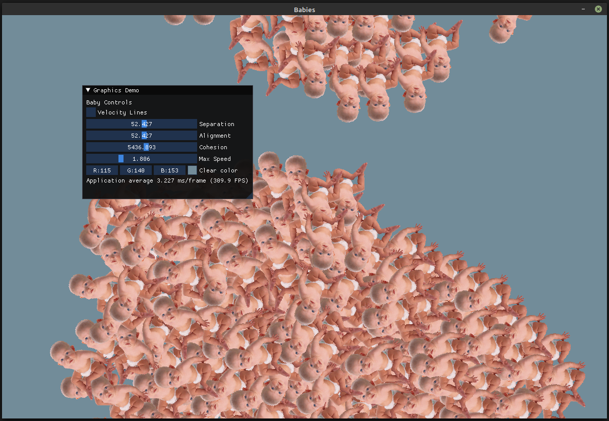

  

## SDL Boids

SDL and ImGUI implementation of Graid Reynolds 1986 boid flocking algorithms.

[Craig Reynold's site](https://www.red3d.com/cwr/boids/)
[https://en.wikipedia.org/wiki/Boids](https://en.wikipedia.org/wiki/Boids)

## Building
Clone the repo, change directories into the root directory. Run `make`.
See makefile for dependencies.

## Preview

